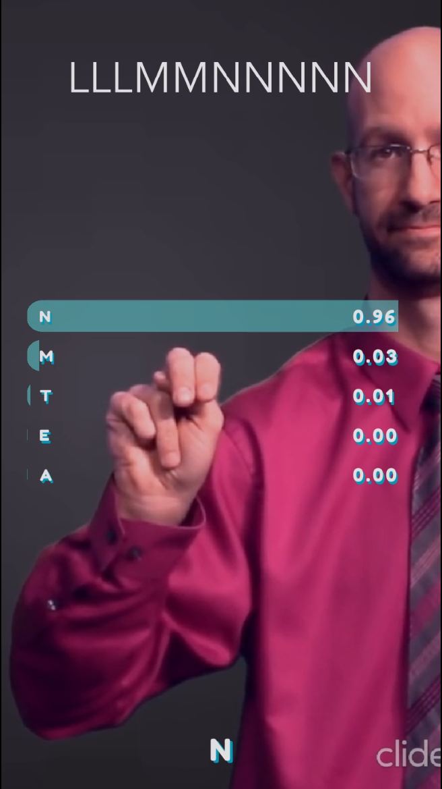
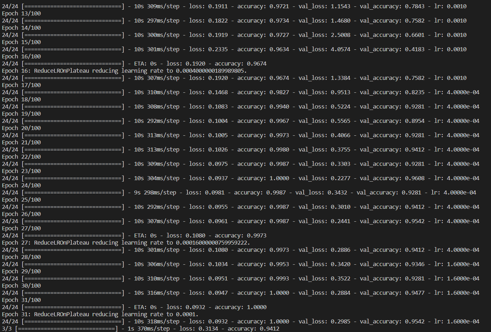
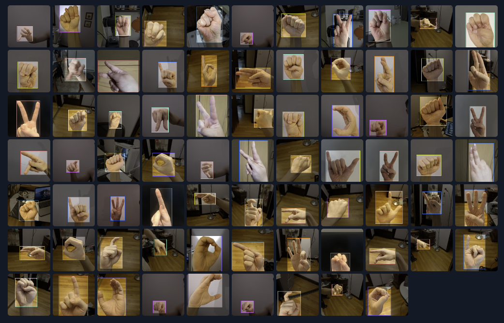

# ASL Transcription in Augmented Reality

## 💡Inspiration

Inspiration came from one of my online friends who is deaf. He likes to create content on tiktok and youtube but doesn't like the fact that he would need to write captions to convey his thoughts to his audience.
I created this ASL transcriber to hopefully help him create content by allowing him to express his thoughts using American Sign Language.
The lens would automatically convert the letters into text, letting him create content without worrying about writing captions for every single action.

## 💻What it does

• Uses Machine Learning to classify various hand poses into American Sign Language

• Displays the text in augmented reality.

• High Accuracy allows for more precise transcriptions.

• Tapping Screen shows predictions of current hand on screen

Predicting the N letter:

## 🛠️How we built it

• Lens Studio

• Javascript

• Created model that incorporated transfer learning and image augmentation.

• Tensorflow Hub for MobileNetV2 architecture machine learning model pretrained on ImageNet1k [MobileNetV2 based model created by Google](https://tfhub.dev/google/tf2-preview/mobilenet_v2/classification/4)

• American Sign Language Dataset created by David Lee on roboflow: [Source](https://public.roboflow.com/object-detection/american-sign-language-letters)

• Tensorflow and Keras API to fine tune model: [Link to Model used in this lens](https://github.com/IdkwhatImD0ing/Kaggle/tree/main/SignLanguage)

• Model had a final validation accuracy of 94% on the dataset:

## 🛑Challenges we ran into

• Originally, the built in MobileNet and EfficientNet Models has problems importing into Lens Studio. Wasted over a week's time creating a model from scratch befire finding a model on Tensorflow Hub that imported successfully.

• Lens Studio's API and Template Documentation was a bit confusing, took a while to fully understand.

• Len's studio would often crash while doing preview, requiring a force quit to restart the program.

• [Original Dataset](https://www.kaggle.com/datasets/grassknoted/asl-alphabet) Turned out to be not official American Sign Language. Hence the high validation accuracy but low real world accuracy. After switching to David Lee's Dataset, real world accuracy became much higher.

• David Lee's dataset was very small, requiring heavy image augmentation to train a properly fitted model. Even then, some poses was unable to be recognized by the model, requiring slight shifts in posture for the model to recognize.

• Original Image:

• Augmented Images:

## ✅Accomplishments that we're proud of

• Successfully training and implementing a Machine Learning Model in an application

• Used heavy image augmentation to expand the limited dataset.

• Deploying a model for the first time in a brand new enviroment and editor.

• By using Hand Tracking, it gives the model a more precise input and also allows the lens to deactivate the model when there is no hand on the screen, preventing erronous predictions.

## 📖What we learned

• Various forms of Image Augmentation

• More ways of using Keras and Tensorflow API such as saving model as .onnx and TFLite file.

• How to use Lens Studio

• Javascript scripting

• ASL

## ⚠️ Known problems

• Due to the small dataset used to train the model, some hand poses are not correctly classified. Would need a larger dataset to correct this issue.

• Tapping the screen once shows predictions, but tapping screen multiple times would break the lens.

## 🛣️ Future Plans

• Once a larger dataset becomes available, re-train model for more accurate real world performance

• Convert [Python Word Ninja](https://github.com/keredson/wordninja) to javascript inorder to probabilistically split concatenated words. However, this is unfeasible at this time due to the chance of incorrectly predicted letters.

Word Ninja Usage:

